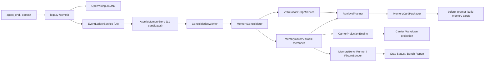

# OpenClaw Memory Fabric — 架构文档

> 本文档描述 `openclaw-memory-fabric` 的完整架构设计、核心模块与数据流。
> 涵盖基础设施 (Phase 1-14)、自学习增强 (P0-P2)、Inspector Web UI (Phase B)、
> 自学习闭环 (Phase C)、生命周期管理 (Phase D)、性能与扩展 (Phase E)、
> 多工作空间联邦 (Phase F)、动态注入模板 (Phase G)。

---

## 0. 自研 v2 生产化补充

v2 是当前生产化主线，目标是在不修改 OpenClaw 官方核心源码的前提下，把 plugin、sidecar、web 和 workspace 工具层升级为证据驱动的分层记忆系统。旧 `/recall`、`/commit`、`/carrier/*` 继续保留，v2 通过 `MEMORY_FABRIC_V2_MODE=off|shadow|v2-recall|v2-write` 灰度。



v2 的关键边界：

- L0 event ledger 是 append-only 证据账本，记录消息、工具调用、文件摘要、diff、附件摘要、运行时错误和状态。
- L1 candidate queue 是低风险写入入口；没有 `sourceRefs` 的内容只能停留在 `needs_review` 或 `rejected`。
- `MemoryConsolidator` 负责 promotion、去重、冲突检测、`supersedes`、`validUntil`、质量评分和 relation graph 写入。
- `RetrievalPlanner` 负责可解释检索计划和 Hybrid RRF，`MemoryCardPackager` 只向 prompt 注入 evidence-backed memory cards。
- Carrier 是结构化记忆的 Markdown 投影，不再作为唯一事实源；projection apply 前记录 rollback patch，并要求 patch 属于 schema whitelist 且带 `memory-fabric projection` 所有权标记，可审计和回滚。
- `V2RelationGraphService` 从共现图升级为语义关系图，支持 `DECIDES`、`IMPLEMENTS`、`SUPERSEDES`、`CAUSES`、`VALIDATES`、`CONSTRAINS`。
- `MemoryBenchFixtureSeeder` 负责把真实或默认 bench cases 灌入 L0/L1/stable memory；`GET /v2/gray/status` 把 mode、worker、candidate queue、recall audit 和 latest bench 汇总为灰度决策面板。

## 1. 整体架构

```
                              Browser
                                │
                                ▼
                    ┌───────────────────────┐
                    │   Inspector Web UI    │
                    │  React + Vite + TW    │
                    │  (6 页面 SPA, :7811)   │
                    └───────────┬───────────┘
                                │ HTTP
                                ▼
┌─────────────────────────────────────────────────────────────────────────┐
│                         Plugin (Gateway 进程内)                          │
│                                                                          │
│  ┌──────────────────┐  ┌──────────────────┐  ┌──────────────────────┐  │
│  │ before_prompt_   │  │ RecallOrchestrator│  │ CommitOrchestrator   │  │
│  │ build hook       │→ │ ・detectDepth()   │  │ ・distill + commit   │  │
│  │ (上下文注入)       │  │ ・detectTaskType()│  │ ・carrier merge      │  │
│  │                  │  │ ・plan + execute  │  │ ・self-model update  │  │
│  └──────────────────┘  └────────┬─────────┘  └──────────┬───────────┘  │
│                                 │                       │               │
│  ┌──────────────────┐  ┌───────┴───────┐     ┌─────────┴─────────┐   │
│  │ agent-end hook   │→ │ SidecarClient │     │ MetricsCollector  │   │
│  │ (蒸馏 + 回写)     │  │ (HTTP → 7811)│     │ (观测指标)         │   │
│  └──────────────────┘  └───────┬───────┘     └───────────────────┘   │
└─────────────────────────────────┼────────────────────────────────────┘
                                  │ HTTP
                                  ▼
┌─────────────────────────────────────────────────────────────────────────┐
│                      Sidecar (独立进程, port 7811)                       │
│                                                                          │
│  ┌─────────────────┐  ┌─────────────────┐  ┌─────────────────────┐    │
│  │   Routes        │  │   Services      │  │     Stores          │    │
│  │                 │  │                 │  │                     │    │
│  │ /recall      ──►│  │ OpenViking   ──►│  │ JSONL 文件系统       │    │
│  │ /commit         │  │  Service        │  │ ・memories.jsonl    │    │
│  │ /distill        │  │ (TF-IDF+Hybrid) │  │ ・experiences.jsonl │    │
│  │ /patterns       │  ├─────────────────┤  │ ・patterns.jsonl    │    │
│  │ /report         │  │ Experience   ──►│  │ ・embeddings.jsonl  │    │
│  │ /skills/...     │  │  Service        │  ├─────────────────────┤    │
│  │ /batch/recall   │  │ (经验蒸馏+分类)  │  │ Carrier 文件 (MD)   │    │
│  │ /batch/commit   │  ├─────────────────┤  │ ・self-model.md     │    │
│  │ /graph/...      │  │ Pattern      ──►│  │ ・decision-log.md   │    │
│  │ /graph/incr.    │  │  Service        │  │ ・entities-gloss.md │    │
│  │ /lifecycle/gc   │  │ (模式识别)       │  │ ・playbooks.md      │    │
│  │ /federation/... │  ├─────────────────┤  │ ・open-questions.md │    │
│  │ /carrier/...    │  │ Scoring      ──►│  │ ・execution-jrnl.md │    │
│  │ /shared/...     │  │  Service        │  │ ・project-model.md  │    │
│  │ /inspect/...    │  │ (3 维度评分)     │  │ ・identity.md       │    │
│  │ /health         │  ├─────────────────┤  │ ・working-style.md  │    │
│  └─────────────────┘  │ Sharing      ──►│  ├─────────────────────┤    │
│                       │  Service        │  │ Federation 文件      │    │
│                       │ (跨 Agent 共享)  │  │ ・{proj}.jsonl      │    │
│                       ├─────────────────┤  │ ・dependencies.json │    │
│                       │ Lifecycle    ──►│  │ ・approvals.jsonl   │    │
│                       │  Service        │  ├─────────────────────┤    │
│                       │ (衰减+容量+GC)  │  │ Skill 草稿           │    │
│                       ├─────────────────┤  │ ・{type}-{hash}.md  │    │
│                       │ Federation   ──►│  │ ・drafts-meta.json  │    │
│                       │  Service        │  └─────────────────────┘    │
│                       │ (联邦+审批)      │                             │
│                       ├─────────────────┤  ┌─────────────────────┐    │
│                       │ BriefTemplates  │  │ 可选 LLM 层          │    │
│                       │ (G: 动态模板)    │  │ ・EmbeddingService  │    │
│                       ├─────────────────┤  │   (Ollama / OpenAI) │    │
│                       │ Graphify     ──►│  │ ・DistillService    │    │
│                       │  Service        │  │   (启发式 + LLM)     │    │
│                       │ (图谱+增量更新)  │  │ ・SkillGenService   │    │
│                       ├─────────────────┤  │   (Skill 自动生成)   │    │
│                       │ Vector       ──►│  └─────────────────────┘    │
│                       │  Service        │                             │
│                       │ (语义检索)       │                             │
│                       └─────────────────┘                             │
└─────────────────────────────────────────────────────────────────────────┘
```

---

## 2. 核心数据流

### 2.1 记忆召回 (Recall Pipeline)

```
用户消息到达
  │
  ▼
Plugin: before_prompt_build hook
  │
  ├─ RecallOrchestrator.plan(ctx)
  │    ├─ detectDepth(msg)        → l0/l1/l2 (复杂度启发式)
  │    ├─ detectTaskType(msg)     → code_review/debug/architecture/.../general (G)
  │    └─ detectScope(ctx, cfg)   → private/project/shared
  │
  ├─ RecallOrchestrator.execute()
  │    │
  │    ├─ POST /recall (传 agentId, projectId, scope, depth, query, taskType)
  │    │    │
  │    │    ├─ OpenVikingService.recallMemory()
  │    │    │    ├─ 加载 scope 条目 (60s TTL 索引缓存, E1)
  │    │    │    ├─ TF-IDF 评分
  │    │    │    ├─ 衰减评分加权 (D1: 指数衰减 × 类型加权)
  │    │    │    ├─ Hybrid 排序 (如有 VectorService: cosine×0.6 + tfidf×0.4)
  │    │    │    └─ formatBrief() → BriefTemplates (G: 按 taskType 选模板)
  │    │    │
  │    │    ├─ SharedService.recall() (scope=shared 时追加共享记忆)
  │    │    │
  │    │    └─ PatternStore.query() (G: includePatterns=true 时注入 Learned Patterns)
  │    │
  │    ├─ graphBrief() (L1/L2 + projectId → 结构摘要)
  │    │
  │    └─ carrierRead() (L1/L2 + projectId → 任务类型相关的 carrier 文件)
  │         ├─ 基础: self-model.md + project-model.md
  │         └─ 按 TaskType 扩展: debug→open-questions.md, architecture→decision-log.md ...
  │
  ├─ PromptInjectionPolicy
  │    ├─ Graphify freshness gate: missing 跳过，stale 只保留一行提示，fresh 注入详细结构
  │    ├─ Carrier sanitizer: 过滤 memory-fabric 块、compaction summary、conversation summary、dream diary 和原始角色日志
  │    └─ Legacy fallback budget: L1 ≤ 2200 chars，L2 ≤ 4500 chars
  │
  └─ prependContext → 注入 Memory Brief 到 prompt
       <!-- memory-fabric:begin -->
       <!-- depth=l1 scope=project taskType=debug sources=openviking:project|patterns:debug -->
       ## Memory Brief
       > Focus: Debugging — entities and open questions prioritized
       ### Entities ...
       ### Unresolved ...
       <!-- memory-fabric:end -->
```

### 2.2 经验蒸馏 (Commit Pipeline)

```
Agent 会话结束
  │
  ▼
Plugin: agent-end hook
  → CommitOrchestrator.execute()
     → POST /distill (提取 facts/decisions/patterns...)
     → POST /commit (传 toolCalls/turnCount/sessionSummary)
        │
        ├─ v2 mode gate
        │    ├─ off: 只写 legacy
        │    ├─ shadow / v2-recall: legacy primary，异步写 L0 event + L1 candidates
        │    └─ v2-write: 先同步写 L0 event + L1 candidates，再写 legacy JSONL fallback
        │
        ├─ OpenVikingService.commitSession()
        │    ├─ 写入 memories.jsonl (各 scope)
        │    ├─ 版本控制: summary.json 乐观锁 (D3)
        │    └─ VectorService.index(entry)  ← 异步 fire-and-forget
        │
        └─ ExperienceService.postCommitDistill()  ← 异步 fire-and-forget
             ├─ 条件判断 (toolCalls≥3 || turnCount≥5)
             ├─ 5 分钟限频检查
             ├─ LLM 提取 taskType + patterns + lessons / 启发式回退
             ├─ ScoringService.score() (C: 3 维度评分)
             │    ├─ 目标完成度 (0-40)
             │    ├─ 工具效率 (0-30)
             │    └─ 决策质量 (0-30)
             ├─ ExperienceStore.append() → experiences.jsonl
             ├─ 自动去重 (Jaccard ≥0.7, 500 条上限) (C)
             ├─ Carrier 刷新 (>24h 更新 self-model.md)
             │    └─ 信心自动演进: low→medium(15 条)→high(30 条) (C)
             └─ 每 5 条经验 → PatternService.detectPatterns() (C: 从 10 降到 5)
```

### 2.3 模式识别 → Skill 生成 (P1)

```
PatternService.detectPatterns()
  → clusterByTaskType() → evaluateCluster()
     ├─ 过滤: frequency≥2, successRate≥0.8
     ├─ 知识评分过滤 (C: knowledgeScore≥50)
     └─ findCommonToolPairs() (频率 ≥50%)
  → PatternStore.append(pattern)
  → SharingService (P2-3: confidence≥9 时跨 Agent 共享)
  → SkillGenService.onPatternDetected(pattern)
     ├─ hashPattern() 去重检查
     ├─ 门槛: confidence≥3 (C: 从 5 降到 3)
     ├─ generateContent() (LLM / fallback 模板)
     ├─ writeFile() → skills/auto-generated/{taskType}-{hash}.md
     └─ DraftStore.add(meta) 跟踪 pending 状态
```

### 2.4 向量检索 + 自评分 + 共享 (P2)

```
commit 成功后
  → VectorService.index(entry)  ← fire-and-forget 异步
     └─ EmbeddingService.embed(text) (E2: 512 条 LRU 缓存)
        ├─ Ollama /api/embeddings (优先)
        └─ OpenAI /v1/embeddings (fallback)

recall 时
  → VectorService.hybridQuery(query)
     → cosineSimilarity(embedding) × 0.6 + TF-IDF × 0.4
     → RRF merge → 排序返回

ScoringService (C: 多维评分)
  → 3 维度评分（目标完成度 40/工具效率 30/决策质量 30）
  → LLM 评估 / 启发式回退
  → 追加到 experience entry

SharingService (P2-3)
  → confidence ≥ 9 的 pattern
  → Jaccard 工具相似度 ≥ 0.6 匹配目标 agent
  → 写入对方 experiences.jsonl (标记 sharedFrom)
```

### 2.5 记忆生命周期管理 (Phase D)

```
POST /lifecycle/gc
  → runGarbageCollection()
     │
     ├─ purgeRetractedShared()
     │    └─ 删除 >30 天的 revoked 共享条目
     │
     ├─ purgeExpiredDrafts()
     │    └─ 删除 >60 天未审阅的 Skill 草稿
     │
     └─ compactMemoryFile() (扫描所有 agent 目录)
          ├─ 计算每条记忆的衰减分数
          │    score = exp(-0.02 × ageDays) × typeBonus × contentBonus
          │    typeBonus: decision=1.3, pattern=1.2, entity=1.1, fact=1.0
          │    contentBonus: >50字符=1.1
          ├─ 超 1000 条 → 按分数排序保留 750 条
          └─ summary.json 乐观锁版本控制 (冲突检测 + 自动重试)
```

### 2.6 多工作空间联邦 (Phase F)

```
跨项目知识共享流程:

1. 导出 (POST /federation/export)
   → FederationService.exportEntries()
   → 写入 federation/{targetProject}.jsonl
   → 自动更新依赖图谱 (dependencies.json)

2. 导入 (GET /federation/import?projectId=X)
   → FederationService.importEntries()
   → 读取 federation/{projectId}.jsonl (过滤 status=active)

3. 撤回 (POST /federation/revoke)
   → 标记条目 status=revoked

4. 依赖图谱 (GET /federation/dependencies)
   → 返回项目间的 strength + sharedEntities

5. 自适应预算 (POST /federation/recommend-budget)
   → 根据 toolCount/turnCount/queryLength/mentionCount 计算复杂度
   → 复杂度≥5 → l2(5000 tokens), ≥3 → l1(1800), <3 → l0(600)

6. 审批流 (POST /federation/approval/submit → pending → review → approved/rejected)
   → 写入 federation/approvals.jsonl
```

### 2.7 任务类型驱动动态注入 (Phase G)

```
用户消息 → detectTaskType(msg) → TaskType

关键词匹配 (中英双语, 按匹配数评分):
  ┌─────────────┬──────────────────────────────────────┐
  │ code_review  │ review, PR, pull request, diff, 评审   │
  │ debug        │ bug, error, crash, exception, 报错, 排查│
  │ architecture │ architect, system design, 架构, 模块设计 │
  │ devops       │ deploy, CI/CD, docker, k8s, 部署, 运维  │
  │ qa           │ test, coverage, regression, 测试, 覆盖率 │
  │ documentation│ doc, README, changelog, 文档, 说明      │
  │ refactor     │ refactor, rename, extract, 重构, 简化   │
  │ general      │ (无匹配时的默认)                        │
  └─────────────┴──────────────────────────────────────┘

TaskType → TemplateConfig:
  ┌─────────────┬────────────────────────────┬──────────────┐
  │ TaskType     │ Section 顺序 (重点加粗)     │ 额外 Carriers │
  ├─────────────┼────────────────────────────┼──────────────┤
  │ code_review  │ **decision**, **pattern**,  │ decision-log │
  │              │ fact, entity               │ playbooks    │
  │ debug        │ **entity**, **unresolved**, │ open-questions│
  │              │ fact, decision             │ entities-glos│
  │ architecture │ **decision**, **entity**,   │ decision-log │
  │              │ fact, pattern              │ entities-glos│
  │ devops       │ **fact**, decision,         │ playbooks    │
  │              │ **pattern**, entity        │              │
  │ qa           │ **fact**, **pattern**,      │ playbooks    │
  │              │ unresolved, entity         │ open-questions│
  │ documentation│ **entity**, **fact**,       │ entities-glos│
  │              │ decision                   │              │
  │ refactor     │ **entity**, **decision**,   │ entities-glos│
  │              │ pattern, fact              │ decision-log │
  │ general      │ fact, decision, entity,    │ (无)          │
  │              │ pattern, unresolved        │              │
  └─────────────┴────────────────────────────┴──────────────┘

重点 section 获得 1.5× 条目预算; 非重点 section 获得基础预算。
includePatterns=true 时，/recall 追加 "### Learned Patterns ({taskType})" section。
```

---

## 3. 存储架构

所有数据基于 **JSONL 文件系统**，零额外数据库依赖。

### 3.1 OpenViking 记忆存储

| 存储 | 路径 | 格式 | 说明 |
|------|------|------|------|
| 私有记忆 | `{basePath}/org/default/agents/{agentId}/private/memories.jsonl` | JSONL | 单 agent 私有 |
| 项目记忆 | `{basePath}/org/default/agents/{agentId}/projects/{projectId}/memories.jsonl` | JSONL | 项目级作用域 |
| 共享记忆 | `{carriersRoot}/shared/projects/{projectId}/published-memory.jsonl` | JSONL | 项目共享 |
| 组织共享 | `{carriersRoot}/shared/org/published-memory.jsonl` | JSONL | 组织级共享 |
| 版本控制 | `{scope目录}/summary.json` | JSON | 乐观锁 (D3) |

### 3.2 经验与模式存储

| 存储 | 路径 | 格式 | 说明 |
|------|------|------|------|
| 经验 | `{basePath}/org/default/agents/{agentId}/experiences.jsonl` | JSONL | commit 后异步写入 |
| 模式 | `{basePath}/org/default/agents/{agentId}/patterns.jsonl` | JSONL | 模式检测后写入 |
| 向量 | `{basePath}/embeddings.jsonl` | JSONL | commit 后异步 index |

### 3.3 Carrier 载体文件

| 存储 | 路径 | 格式 | 说明 |
|------|------|------|------|
| Agent 私有 | `{carriersRoot}/agents/{agentId}/private/{identity,working-style,self-model}.md` | Markdown | |
| 项目级 | `{carriersRoot}/agents/{agentId}/projects/{projectId}/{project-model,decision-log,entities-glossary,playbooks,open-questions,execution-journal}.md` | Markdown | |

### 3.4 图谱存储

| 存储 | 路径 | 格式 | 说明 |
|------|------|------|------|
| 图谱数据 | `{graphBasePath}/{projectId}/graphify-out/graph.json` | JSON | 节点 + 边 |
| 图谱报告 | `{graphBasePath}/{projectId}/graphify-out/GRAPH_REPORT.md` | Markdown | 可读摘要 |

### 3.5 Skill 草稿

| 存储 | 路径 | 格式 | 说明 |
|------|------|------|------|
| 草稿 | `~/.openclaw/skills/auto-generated/{taskType}-{hash}.md` | Markdown | [AUTO-DRAFT] 标记 |
| 元数据 | `~/.openclaw/skills/auto-generated/drafts-meta.json` | JSON | pending/reviewed/ignored |

### 3.6 联邦存储 (Phase F)

| 存储 | 路径 | 格式 | 说明 |
|------|------|------|------|
| 联邦条目 | `{carriersRoot}/federation/{projectId}.jsonl` | JSONL | 导出/导入条目 |
| 依赖图谱 | `{carriersRoot}/federation/dependencies.json` | JSON | 项目间关系 |
| 审批记录 | `{carriersRoot}/federation/approvals.jsonl` | JSONL | 待审/已审条目 |

---

## 4. Inspector Web UI (Phase B)

React 18 + Vite + TypeScript + Tailwind CSS 构建的 SPA，通过 `@fastify/static` 从 Sidecar 提供静态文件。

| 页面 | 组件 | 功能 |
|------|------|------|
| 总览 | `<Overview />` | 系统健康状态、关键统计 |
| 记忆浏览 | `<MemoryBrowser />` | 搜索、过滤、查看记忆条目 |
| 知识图谱 | `<GraphView />` | react-force-graph-2d 可视化项目图谱 |
| 载体文件 | `<CarrierViewer />` | react-markdown 渲染 carrier 内容 |
| 自学习仪表板 | `<LearningDashboard />` | 经验趋势、模式、评分报告 |
| 联邦管理 | `<FederationPage />` | 跨项目导入/导出/审批 (Phase F) |

上下文状态: `{ agentId, projectId, scope, depth, agents[] }`, 全局共享给所有页面组件。

---

## 5. 环境变量

### 5.1 必需

| 变量 | 说明 | 示例 |
|------|------|------|
| `PORT` | Sidecar 端口 | `7811` |
| `HOST` | Sidecar 地址 | `127.0.0.1` |
| `OPENVIKING_BASE_PATH` | OpenViking 数据根目录 | `~/.openviking/data/viking/openclaw-personal` |
| `CARRIERS_ROOT` | Carrier 文件根目录 | `~/.memory-fabric/carriers` |
| `MEMORY_FABRIC_V2_MODE` | v2 灰度模式：`off`、`shadow`、`v2-recall`、`v2-write` | `v2-recall` |
| `MEMORY_FABRIC_V2_WRITE_AGENT_IDS` | 逗号分隔的 v2-write 单 Agent allowlist，优先级高于全局模式 | `product` |
| `MEMORY_FABRIC_V2_RECALL_AGENT_IDS` | 逗号分隔的 v2-recall 单 Agent allowlist | `development,product` |
| `MEMORY_FABRIC_V2_SHADOW_AGENT_IDS` | 逗号分隔的 shadow 单 Agent 回退 allowlist | `product` |
| `MEMORY_FABRIC_V2_OFF_AGENT_IDS` | 逗号分隔的 off 单 Agent 紧急关闭 allowlist，优先级最高 | `product` |
| `MEMORY_FABRIC_CONSOLIDATION_WORKER` | 是否随 sidecar 自动启动巩固 worker；默认关闭，`auto/on/true/1` 开启 | `auto` |
| `MEMORY_FABRIC_CONSOLIDATION_AGENT_ID` | 自动 worker 可选 Agent 过滤 | `development` |
| `MEMORY_FABRIC_CONSOLIDATION_PROJECT_ID` | 自动 worker 可选 Project 过滤 | `openclaw-memory-fabric` |
| `MEMORY_FABRIC_CONSOLIDATION_INTERVAL_MS` | 自动 worker 运行间隔 | `30000` |
| `MEMORY_FABRIC_CONSOLIDATION_LIMIT` | 自动 worker 每轮处理上限 | `100` |

运行时灰度配置由 `V2RolloutConfigService` 管理，Inspector 的多 Agent 面板会写入持久化 runtime override。有效模式解析顺序固定为：

1. `MEMORY_FABRIC_V2_OFF_AGENT_IDS`，紧急关闭优先级最高。
2. Inspector runtime override，支持按 Agent/Project 设置和回滚。
3. 环境 allowlist：`WRITE_AGENT_IDS`、`RECALL_AGENT_IDS`、`SHADOW_AGENT_IDS`。
4. 全局 `MEMORY_FABRIC_V2_MODE`。

plugin 的 `before_prompt_build` 会在每次召回前调用 `/v2/rollout/effective` 获取有效模式；sidecar `/commit` 也使用同一解析器，避免 Web 面板显示和真实写入/注入路径不一致。

### 5.2 OpenClaw 上下文压缩治理

OpenClaw runtime compaction 仍由 `~/.openclaw/openclaw.json` 控制，Memory Fabric 不修改 OpenClaw 官方核心源码。全 Agent 默认采用提前保护配置：`reserveTokens=48000`、`reserveTokensFloor=30000`、`maxHistoryShare=0.65`、`maxActiveTranscriptBytes=16mb`、`notifyUser=true`，并要求压缩摘要包含 `Files Modified`、`Open Questions`、`Next Steps`。

Memory Fabric 负责降低压缩后的二次污染风险：`before_prompt_build` 不再信任 stale Graphify 详细结构，也不会把 Carrier 中的 compaction summary、conversation summary、memory-fabric 注入块或原始 System/User/Assistant 日志重新注入 prompt。V2 Inspector 的 Context Health 区域通过 `/v2/context/health` 只读扫描当前 Gateway 日志和 session/trajectory 文件，报告 overflow、timeout、`already_compacted_recently`、stale detailed injection 和超限文件。日志读取按运行态优先级选择：LaunchAgent stdout 日志、`/tmp/openclaw` 当天/前一天日志、近期 legacy `~/.openclaw/logs/gateway*.log`；过旧 legacy 日志不参与当前健康判定。

### 5.3 可选（经验蒸馏 LLM）

| 变量 | 说明 | 示例 |
|------|------|------|
| `EXPERIENCE_LLM_BASE_URL` | LLM API 地址 | `http://127.0.0.1:11434/v1` |
| `EXPERIENCE_LLM_MODEL` | 模型名 | `qwen2.5:3b` |
| `EXPERIENCE_LLM_API_KEY` | API Key | `ollama` |
| `EXPERIENCE_LLM_MAX_TOKENS` | 最大 token | `512` |
| `EXPERIENCE_LLM_TIMEOUT_MS` | 超时 | `5000` |

### 5.4 可选（向量检索 Embedding）

| 变量 | 说明 | 示例 |
|------|------|------|
| `EMBEDDING_BASE_URL` | Embedding API 地址 | `http://127.0.0.1:11434` |
| `EMBEDDING_MODEL` | 模型名 | `nomic-embed-text` |
| `EMBEDDING_TIMEOUT_MS` | 超时 | `10000` |

> 不配置 `EMBEDDING_BASE_URL` 时，向量检索自动降级为纯 TF-IDF。嵌入结果缓存上限 512 条 (LRU, Phase E)。

---

## 6. API 端点全览

### 6.1 核心端点

| 方法 | 路径 | 说明 | 阶段 |
|------|------|------|------|
| GET | `/health` | 健康检查 (含组件状态) | Phase 4 |
| POST | `/distill` | 消息蒸馏 | Phase 8 |
| POST | `/commit` | 提交记忆 (触发异步经验蒸馏) | Phase 5 |
| POST | `/recall` | 召回记忆 (支持 taskType 动态模板) | Phase 5 + G |
| POST | `/carrier/init` | 初始化 carrier 目录 | Phase 6 |
| POST | `/carrier/read` | 读取 carrier 文件 | Phase 6 |
| POST | `/carrier/merge` | 合并 carrier 文件 | Phase 6 |

### 6.2 图谱端点

| 方法 | 路径 | 说明 | 阶段 |
|------|------|------|------|
| POST | `/bootstrap` | 初始化项目图谱 | Phase 9 |
| POST | `/graph/brief` | 结构摘要 | Phase 9 |
| POST | `/graph/query` | 节点搜索 | Phase 9 |
| POST | `/graph/path` | 路径查找 (BFS) | Phase 9 |
| POST | `/graph/explain` | 节点解释 + 邻居 | Phase 9 |
| POST | `/graph/incremental` | 增量图谱更新 (最多 100 文件) | Phase E |

### 6.3 自学习端点

| 方法 | 路径 | 说明 | 阶段 |
|------|------|------|------|
| GET | `/patterns?agentId=` | 查询识别出的模式 | P1 |
| GET | `/skills/drafts` | 查询待审阅 Skill 草稿 | P1 |
| GET | `/report?agentId=` | 自评分报告 (taskType 均分+趋势) | P2 |
| GET | `/inspect/learning-curve?agentId=&days=` | 学习曲线数据 | Phase C |

### 6.4 共享治理端点

| 方法 | 路径 | 说明 | 阶段 |
|------|------|------|------|
| POST | `/shared/publish` | 发布共享记忆 | Phase 11 |
| POST | `/shared/forget` | 撤回共享记忆 | Phase 11 |

### 6.5 批量操作端点

| 方法 | 路径 | 说明 | 阶段 |
|------|------|------|------|
| POST | `/batch/recall` | 并行召回 (最多 10 个请求) | Phase E |
| POST | `/batch/commit` | 批量提交 (最多 10 个提交) | Phase E |

### 6.6 联邦端点

| 方法 | 路径 | 说明 | 阶段 |
|------|------|------|------|
| POST | `/federation/export` | 跨项目知识导出 | Phase F |
| GET | `/federation/import?projectId=` | 导入联邦知识 | Phase F |
| POST | `/federation/revoke` | 撤回已导出条目 | Phase F |
| GET | `/federation/dependencies` | 多项目依赖图谱 | Phase F |
| POST | `/federation/recommend-budget` | 自适应记忆预算推荐 | Phase F |
| POST | `/federation/approval/submit` | 提交待审核条目 | Phase F |
| GET | `/federation/approval/pending?projectId=` | 查看待审批列表 | Phase F |
| POST | `/federation/approval/review` | 审批条目 | Phase F |

### 6.7 生命周期端点

| 方法 | 路径 | 说明 | 阶段 |
|------|------|------|------|
| POST | `/lifecycle/gc` | 垃圾回收 (共享+草稿+压缩) | Phase D |

### 6.8 v2 生产化端点

| 方法 | 路径 | 说明 | 阶段 |
|------|------|------|------|
| POST | `/v2/events` | 追加 L0 evidence event | v2 Phase 1 |
| POST | `/v2/memories/candidates` | 写入 L1 candidate | v2 Phase 1 |
| GET | `/v2/memories/candidates` | 查询 candidate queue | v2 Phase 1 |
| GET | `/v2/memories/candidates/stats` | candidate 状态和类型统计 | v2 Phase 1 |
| POST | `/v2/memories/candidates/:id/review` | 人工 approve/reject candidate | v2 Phase 1 |
| POST | `/v2/memories/candidates/retry` | 批量 retry candidate | v2 Phase 1 |
| POST | `/v2/consolidation/run` | 手动巩固 pending candidates | v2 Phase 1 |
| POST | `/v2/consolidation/worker/start` | 启动巩固 worker | v2 Phase 1 |
| POST | `/v2/consolidation/worker/stop` | 停止巩固 worker | v2 Phase 1 |
| GET | `/v2/consolidation/status` | worker 状态和 candidate stats | v2 Phase 1 |
| GET | `/v2/rollout/effective` | 单 Agent/Project 有效灰度模式 | v2 Milestone D |
| GET | `/v2/rollout/modes` | 多 Agent 灰度配置与运行指标 | v2 Milestone D |
| POST | `/v2/rollout/modes` | 设置单 Agent/Project runtime override | v2 Milestone D |
| POST | `/v2/rollout/modes/rollback` | 回滚单 Agent/Project runtime override | v2 Milestone D |
| GET | `/v2/gray/status` | 灰度汇总状态和 readiness flags | v2 Milestone A |
| GET | `/v2/canary/status` | 单 Agent v2-write 只读巡检状态 | v2 Milestone C |
| POST | `/v2/recall/plan` | 可解释检索计划和 memory cards | v2 Phase 2 |
| POST | `/v2/recall/audit` | 写入 legacy/v2 recall 对照日志 | v2 Phase 2 |
| GET | `/v2/recall/audit` | 查询 recall 对照日志 | v2 Phase 2 |
| GET | `/v2/memories/:id/trace` | 查看 source trace 和 relation trace | v2 Phase 2 |
| GET | `/v2/carriers/drift` | Carrier 投影漂移审计 | v2 Phase 3 |
| POST | `/v2/carriers/projection/apply` | 应用 Carrier projection | v2 Phase 3 |
| POST | `/v2/carriers/projection/rollback` | 回滚 Carrier projection | v2 Phase 3 |
| GET | `/v2/carriers/projection/history` | 查询 projection 历史 | v2 Phase 3 |
| GET | `/v2/graph/relations` | 查询语义关系图 | v2 Phase 4 |
| GET | `/v2/bench/fixtures` | 读取持久化 Bench fixture 文件 | v2 Milestone B |
| POST | `/v2/bench/fixtures` | 保存真实 Bench fixture cases | v2 Milestone B |
| POST | `/v2/bench/seed` | 灌入可重复 Bench fixture | v2 Milestone B |
| POST | `/v2/bench/run` | 运行 Memory Bench | v2 Phase 5 |
| GET | `/v2/bench/report` | 读取 latest Bench report | v2 Phase 5 |

---

## 7. 关键常量与阈值

### 7.1 记忆召回

| 参数 | 值 | 说明 |
|------|-----|------|
| L0 token 预算 | 600 | 浅层召回 |
| L1 token 预算 | 1,800 | 中层召回 |
| L2 token 预算 | 5,000 | 深层召回 |
| L0 最大条目 | 5 | |
| L1 最大条目 | 20 | |
| L2 最大条目 | 60 | |
| 索引缓存 TTL | 60s | OpenViking 内存缓存 (E1) |
| 嵌入缓存上限 | 512 条 | LRU 策略 (E2) |

### 7.2 衰减评分 (Phase D)

| 参数 | 值 | 说明 |
|------|-----|------|
| DECAY_RATE_PER_DAY | 0.02 | 指数衰减因子 |
| MIN_DECAY_SCORE | 0.1 | 低于此值可被清理 |
| MAX_MEMORY_ENTRIES | 1,000 | 触发压缩的阈值 |
| TARGET_ENTRIES | 750 | 压缩后目标条数 |
| RETRACTED_MAX_AGE_DAYS | 30 | 撤回共享条目最大保留天数 |
| DRAFT_MAX_AGE_DAYS | 60 | 未审阅草稿最大保留天数 |

### 7.3 经验蒸馏与模式检测

| 参数 | 值 | 说明 |
|------|-----|------|
| MIN_TOOL_CALLS | 3 | 触发蒸馏的最低工具调用数 |
| MIN_TURNS | 5 | 触发蒸馏的最低对话轮数 |
| RATE_LIMIT_MS | 5 分钟 | 同 agent 蒸馏限频 |
| CARRIER_STALE_MS | 24 小时 | self-model 刷新阈值 |
| 模式检测频率 | 每 5 条经验 | Phase C 从 10 降到 5 |
| MIN_FREQUENCY (模式) | 2 | 最低出现次数 |
| MIN_SUCCESS_RATE (模式) | 0.8 | 最低成功率 |
| Skill 生成门槛 | confidence ≥ 3 | Phase C 从 5 降到 3 |
| 经验去重阈值 | Jaccard ≥ 0.7 | 相同 taskType 的相似 outcome |
| 经验上限 | 500 条 | 超过后自动去重压缩 |

### 7.4 信心演进 (Phase C)

| 阶段 | 所需经验条数 | 信心等级 |
|------|------------|---------|
| 初始 | < 5 | low |
| 中期 | ≥ 15 | medium |
| 成熟 | ≥ 30 | high |

### 7.5 评分维度 (Phase C)

| 维度 | 满分 | 评估内容 |
|------|------|---------|
| 目标完成度 | 40 | 用户请求是否解决 |
| 工具效率 | 30 | 工具使用是否高效 |
| 决策质量 | 30 | 技术决策是否合理 |

### 7.6 图谱参数

| 参数 | 值 | 说明 |
|------|-----|------|
| 可扫描扩展名 | .ts/.js/.py/.go/.java/.rb/.md/.yaml/.json 等 | |
| 跳过目录 | node_modules, .git, dist, build 等 | |
| 最大扫描文件 | 500 | |
| 最大保留节点 | 200 | 按 mentions 排序 |
| 最大保留边 | 500 | 按 weight 排序 |
| 图谱新鲜度阈值 | 24 小时 | < 24h = fresh, ≥ 24h = stale |
| 增量更新文件上限 | 100 | /graph/incremental 请求限制 |

### 7.7 联邦参数 (Phase F)

| 参数 | 值 | 说明 |
|------|-----|------|
| 导入限制 | 默认 50, 最大 200 | 每次导入条目数 |
| 依赖 sharedEntities 上限 | 20 | 每条依赖最多 20 个共享实体 |
| 高复杂度阈值 (score) | ≥ 5 | → l2 (5000 tokens) |
| 中复杂度阈值 (score) | ≥ 3 | → l1 (1800 tokens) |
| 低复杂度阈值 (score) | < 3 | → l0 (600 tokens) |

### 7.8 动态模板参数 (Phase G)

| 参数 | 值 | 说明 |
|------|-----|------|
| 重点 section 权重 | 1.5× | 相对于基础预算的倍数 |
| Learned Patterns 限制 | 3 条 | 每次召回最多注入 3 条模式 |
| TaskType 检测策略 | 匹配数最高者胜出 | ≥1 即触发，0 匹配 → general |

---

## 8. 关键设计决策

1. **纯 JSONL 文件系统**：不引入 SQLite/PostgreSQL，零额外依赖，万级条目 brute-force 无压力。
2. **异步非阻塞**：所有新增能力（蒸馏、模式检测、向量 index、共享）均为 fire-and-forget，失败不影响主流程。
3. **5 分钟限频**：同一 agent 5 分钟内最多触发一次经验蒸馏，避免高频 commit 场景下的资源浪费。
4. **Skill 安全门禁**：自动生成标记 `[AUTO-DRAFT]`，放入独立目录，需人工确认才生效。
5. **Hash 去重**：同一 pattern 内容（taskType + tools + lessons 的 md5）不重复生成草稿。
6. **混合检索**：cosine × 0.6 + TF-IDF × 0.4，兼顾语义相关性和关键词匹配。
7. **指数衰减 + 类型加权**（D）：decision 类型衰减最慢 (1.3×)，fact 最快 (1.0×)，兼顾长期价值保留。
8. **乐观锁版本控制**（D）：summary.json 中的 version 字段实现并发冲突检测，自动重试。
9. **多级缓存策略**（E）：索引缓存 (60s TTL) + 嵌入缓存 (512 LRU) + 增量图谱更新，减少重复计算。
10. **联邦审批流**（F）：submit → pending → approved/rejected 三态，确保跨项目知识共享有治理。
11. **任务类型驱动模板**（G）：8 种模板配置，重点 section 获 1.5× 条目预算，无匹配时优雅降级到 general。
12. **薄插件原则**：Plugin 进程内只做关键词检测与路由，重计算全部在 Sidecar 进程完成。
13. **多级降级**：Graphify 不可用 → 跳过结构摘要；OpenViking 不可用 → 只用 carriers；Sidecar 不可用 → 插件返回降级注释。

---

## 9. 降级策略

| 故障 | 降级方式 | 影响 |
|------|---------|------|
| Sidecar 不可用 | 插件返回 `<!-- memory-fabric: recall unavailable -->` | 无记忆注入，不阻塞会话 |
| Graphify 不可用 | 跳过 structural brief | 失去结构认知，仅用记忆+载体 |
| OpenViking 不可用 | 仅使用 carriers + graphify | 失去检索召回 |
| VectorService 不可用 | 降级为纯 TF-IDF + 衰减评分 | 失去语义检索 |
| LLM 不可用 | 启发式回退（正则提取 taskType/patterns/lessons） | 精度降低 |
| EmbeddingService 不可用 | VectorService 自动降级为 TF-IDF only | |
| 共享目录冲突 | 延迟写入并记录待处理项 | |
| Graph 文件缺失 | freshness="missing"，提示 bootstrap | |

---

*文档版本: v1.8.0 完整版 (Phase 1-14 + B-G) | 更新日期: 2026-05-21*
