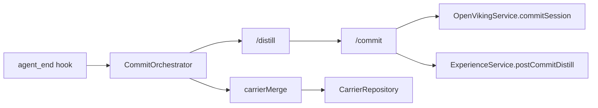
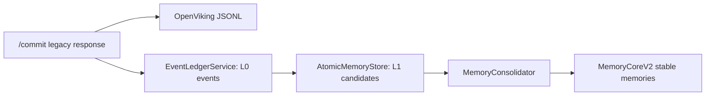
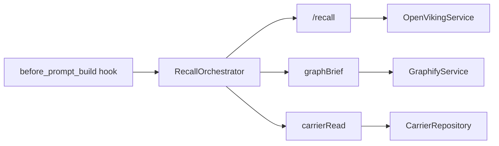
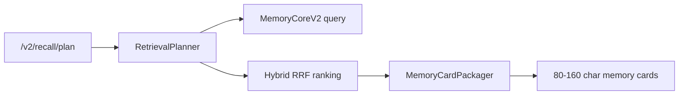

# OpenClaw Memory Fabric 自研 v2 实施基线

> 日期：2026-06-10
> 路线：自研 v2，不安装 Hy-Memory 插件，不引入 Hy-Memory 运行时依赖。

## 1. 现状链路图

### 写入链路

v2 shadow-write 在 `/commit` 内并行追加：

### 读取链路

v2 读取规划链路：

## 2. 已落地组件

- `EventLedgerService`：append-only L0 event，生成 `eventId`、`contentHash`、`sourceUri`。
- `AtomicMemoryStore`：候选 L1 pending queue；无 `sourceRefs` 默认进入 `needs_review`。
- `ConsolidationWorker`：后台处理 pending candidates，提供 start、stop、status、last result、last error 和 in-flight 幂等锁。
- `MemoryConsolidator`：执行 source gate、质量评分、重复检测、`supersedes`、`validUntil` 和稳定库 promotion；profile/intent 需要明确用户指令、多源高质量证据或人工 review。
- `RetrievalPlanner`：识别 fact lookup、decision history、task continuation、rule execution、entity relation，并返回可解释 plan；entity relation intent 接入 relation graph 排序增强。
- `MemoryCardPackager`：把稳定记忆压缩为 evidence-backed cards，支持去重、token budget、证据摘要、冲突/过期标记。
- `CarrierProjectionEngine`：把结构化记忆审计为 Carrier Markdown 投影，支持 drift audit、apply、rollback 和 history。
- `V2RelationGraphService`：记录 `DECIDES`、`IMPLEMENTS`、`SUPERSEDES`、`CAUSES`、`VALIDATES`、`CONSTRAINS` 关系边。
- `RecallAuditLogService`：记录 v2-recall 灰度期间 legacy recall 与 v2 recall 的对照日志。
- `MemoryBenchRunner`：内置 30+ 个 v0 用例，记录 Recall@5、Injection Precision、Stale Rate、Source Coverage、平均注入长度、P95 latency，并持久化 latest report。
- `MemoryBenchFixtureSeeder`：把默认、自定义或持久化 fixture cases 可重复写入 L0 event、L1 candidate 并触发 promotion；用于真实灰度前建立稳定 fixture。

## 3. API 基线

- `POST /v2/events`：写入 L0 event。
- `POST /v2/memories/candidates`：写入 pending L1 candidates。
- `GET /v2/memories/candidates`：查询候选记忆，支持 `agentId`、`projectId`、`status`。
- `GET /v2/memories/candidates/stats`：查看候选状态和类型统计。
- `POST /v2/memories/candidates/:id/review`：人工 approve/reject。
- `POST /v2/memories/candidates/retry`：批量重置 failed/review candidates。
- `POST /v2/consolidation/run`：手动触发巩固。
- `POST /v2/consolidation/worker/start` / `stop`：启动或停止后台巩固 worker。
- `GET /v2/consolidation/status`：查看 worker 与 candidate stats。
- `GET /v2/gray/status`：汇总灰度 mode、worker、candidate stats、recall audit、latest bench 和 readiness flags。
- `POST /v2/recall/plan`：返回 retrieval plan、entries、memory cards 和渲染文本。
- `POST /v2/recall/audit` / `GET /v2/recall/audit`：记录和查询 legacy/v2 recall 对照日志。
- `GET /v2/memories/:id/trace`：查看 `sourceRefs`、原始 sources 和 L0 events。
- `GET /v2/carriers/drift?agentId=&projectId=`：查看 Carrier 投影漂移。
- `POST /v2/carriers/projection/apply`：应用结构化记忆到 Carrier 投影。
- `POST /v2/carriers/projection/rollback`：按 projectionId 回滚 Carrier 投影。
- `GET /v2/carriers/projection/history`：查看投影历史。
- `GET /v2/graph/relations`：查询 v2 关系图。
- `GET /v2/bench/fixtures` / `POST /v2/bench/fixtures`：读取和保存真实 Bench fixture 文件。
- `POST /v2/bench/seed`：把默认或自定义 bench cases 灌入 L0/L1/stable memory。
- `POST /v2/bench/run`：运行 Memory Bench v0。
- `GET /v2/bench/report`：读取最新 Bench 报告。

旧接口 `/recall`、`/commit`、`/carrier/*` 保持兼容；`MEMORY_FABRIC_V2_MODE=off` 可关闭 `/commit` 的 v2 shadow-write。

## 4. Carrier 投影规则

- `self-model.md`：仅接收 L3/L5 高置信 profile、intent；必须有 `sourceRefs`，且质量分达标。
- `decision-log.md`：接收 L1 decision。
- `execution-journal.md`：接收 L2 episode、todo、unresolved。
- `entities-glossary.md`：接收 L1 entity 和 Graphify 后续关系摘要。

Carrier 是结构化记忆的 Markdown 投影，不再作为唯一事实源。

## 5. Bench v0 验收目标

- Recall@5 >= 0.85
- Injection Precision >= 0.80
- Stale Rate <= 0.05
- Source Coverage >= 0.98
- 实时检索 P95 <= 300ms

Bench 结果反映当前记忆库状态；空库或未灌入基线事实时指标会偏低，应先用真实 Agent 会话生成 fixture，并通过 `POST /v2/bench/fixtures` 保存，再用 `POST /v2/bench/seed` + `useFixtures=true` 生成稳定记忆。seed 过程必须可重复：已经存在 `bench_fixture:<caseId>` tag 的 stable memory 时跳过该 case。

## 6. 灰度策略

1. `off`：只跑旧链路。
2. `shadow`：旧链路为主，`/commit` 同步写 L0 event 和 L1 candidate。
3. `v2-recall`：`before_prompt_build` 改为读取 `/v2/recall/plan` 的 memory cards，保留旧 recall 兜底。
4. `v2-write`：稳定后将 commit 主写入切到 v2-first，旧 OpenViking JSONL 与 Carrier 投影作为回退。

首批灰度 Agent：`development`。切主前必须保留旧 `/recall`、旧 Carrier、旧 memory JSONL 回退路径。
